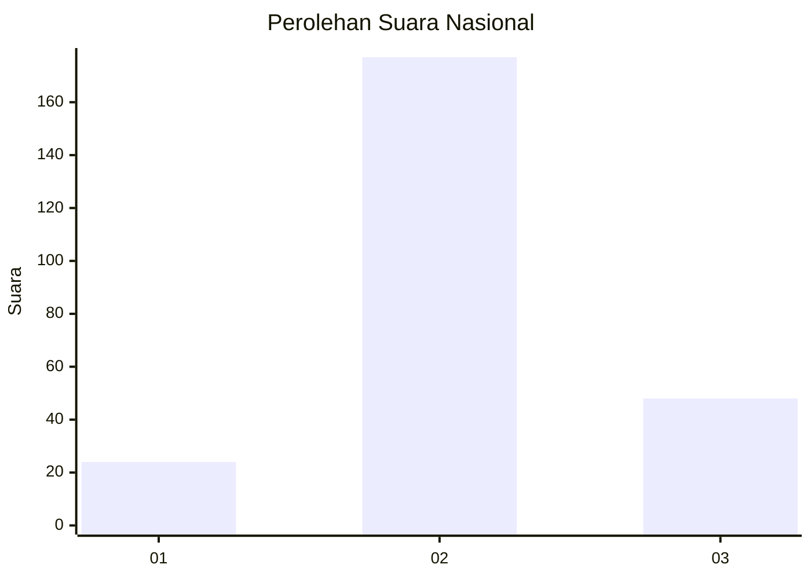
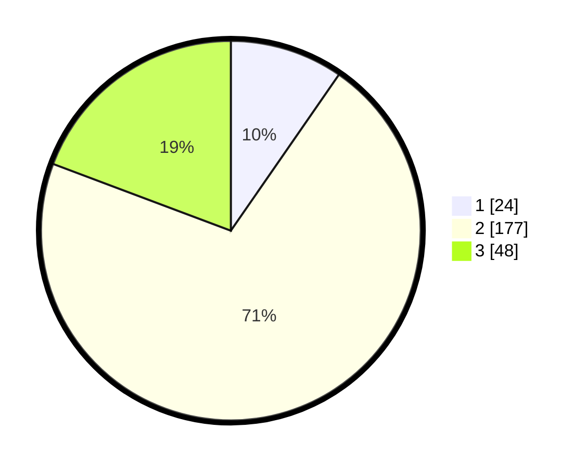

# Hasil

## Grafik

## Tabel

| No. | Nama Paslon    | Suara | Suara (raw) | Persentase |
|:--- |:-------------- | -----:| -----------:| ----------:|
| 1   | ANIES MUHAIMIN | 24    | [24][p-1]   | 9,64       |
| 2   | PRABOWO GIBRAN | 177   | [177][p-2]  | 71,08      |
| 3   | GANJAR MAHFUD  | 48    | [48][p-3]   | 19,28      |

[p-1]: https://github.com/gigit-pemilu/pemilu-2024/blob/main/pilpres/hitung-suara/sub/72-sulawesi-tengah/sub/12-morowali-utara/sub/04-lembo/sub/2001-beteleme/sub/004-tps/sub/paslon-1.txt
[p-2]: https://github.com/gigit-pemilu/pemilu-2024/blob/main/pilpres/hitung-suara/sub/72-sulawesi-tengah/sub/12-morowali-utara/sub/04-lembo/sub/2001-beteleme/sub/004-tps/sub/paslon-2.txt
[p-3]: https://github.com/gigit-pemilu/pemilu-2024/blob/main/pilpres/hitung-suara/sub/72-sulawesi-tengah/sub/12-morowali-utara/sub/04-lembo/sub/2001-beteleme/sub/004-tps/sub/paslon-3.txt

## Foto C Plano

https://sirekap-obj-formc.kpu.go.id/3df5/pemilu/ppwp/72/12/04/20/01/7212042001004-20240215-120844--c4bf1984-0e45-4b36-b041-98e022cdd990.jpg

https://sirekap-obj-formc.kpu.go.id/3df5/pemilu/ppwp/72/12/04/20/01/7212042001004-20240215-023330--8e77ed9d-183d-4088-a514-c3a5cf6de238.jpg

https://sirekap-obj-formc.kpu.go.id/3df5/pemilu/ppwp/72/12/04/20/01/7212042001004-20240215-073809--88140693-eac9-455c-a3c1-9c03cde02b8f.jpg

## Metadata

| Key        | Value               |
| ---------- | ------------------- |
| Time Stamp | 2024-02-15 18:30:25 |

