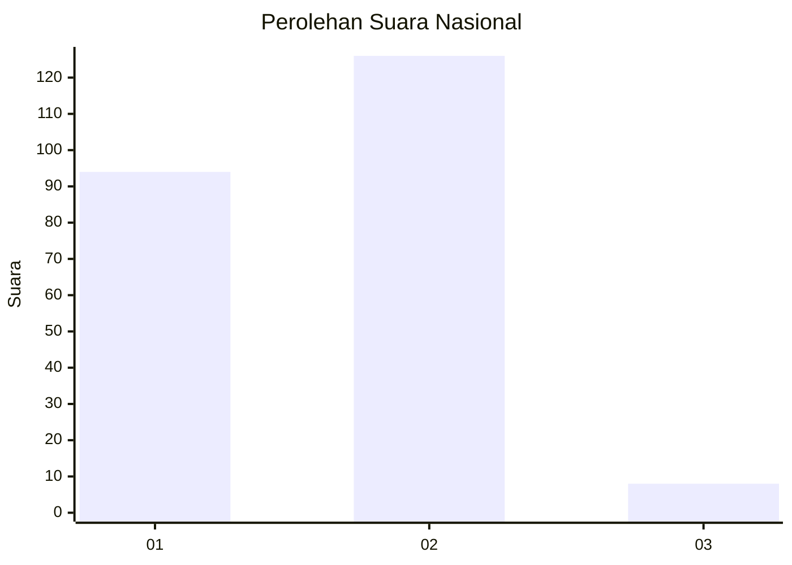
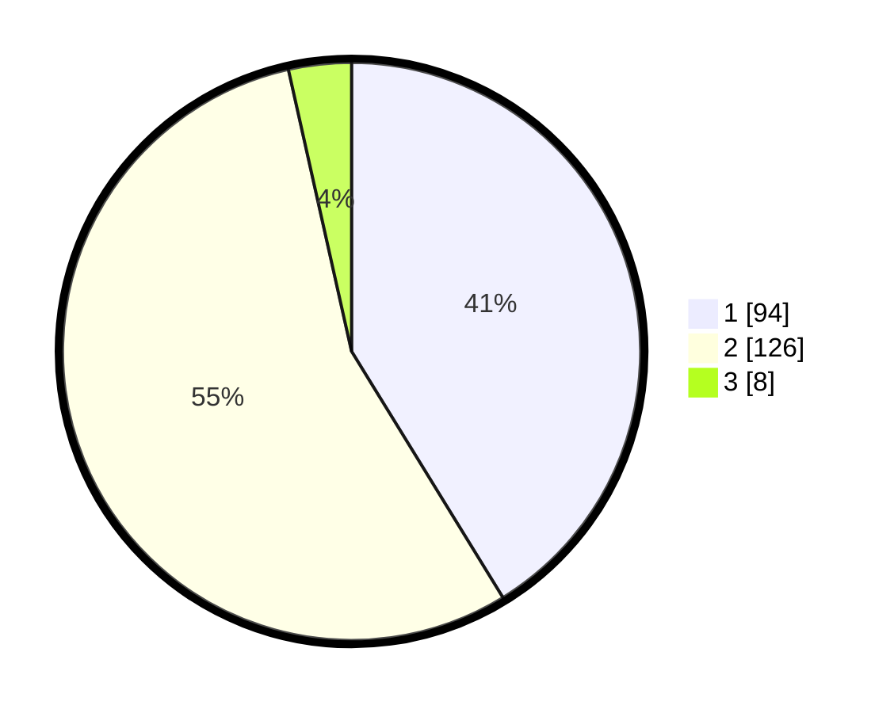

# Hasil

## Grafik

## Tabel

| No. | Nama Paslon    | Suara | Suara (raw) | Persentase |
|:--- |:-------------- | -----:| -----------:| ----------:|
| 1   | ANIES MUHAIMIN | 94    | [94][p-1]   | 41,23      |
| 2   | PRABOWO GIBRAN | 126   | [126][p-2]  | 55,26      |
| 3   | GANJAR MAHFUD  | 8     | [8][p-3]    | 3,51       |

[p-1]: https://github.com/gigit-pemilu/pemilu-2024/blob/main/pilpres/hitung-suara/sub/72-sulawesi-tengah/sub/12-morowali-utara/sub/08-bungku-utara/sub/2001-baturube/sub/003-tps/sub/paslon-1.txt
[p-2]: https://github.com/gigit-pemilu/pemilu-2024/blob/main/pilpres/hitung-suara/sub/72-sulawesi-tengah/sub/12-morowali-utara/sub/08-bungku-utara/sub/2001-baturube/sub/003-tps/sub/paslon-2.txt
[p-3]: https://github.com/gigit-pemilu/pemilu-2024/blob/main/pilpres/hitung-suara/sub/72-sulawesi-tengah/sub/12-morowali-utara/sub/08-bungku-utara/sub/2001-baturube/sub/003-tps/sub/paslon-3.txt

## Foto C Plano

https://sirekap-obj-formc.kpu.go.id/36da/pemilu/ppwp/72/12/08/20/01/7212082001003-20240217-164851--ec16cb7f-959a-471b-bd10-54936ac098ea.jpg

https://sirekap-obj-formc.kpu.go.id/36da/pemilu/ppwp/72/12/08/20/01/7212082001003-20240217-164904--401436c7-c018-4904-82b4-5953fb08dd7d.jpg

https://sirekap-obj-formc.kpu.go.id/36da/pemilu/ppwp/72/12/08/20/01/7212082001003-20240217-164919--b825f9fd-3929-46fd-97e2-00b05dfb0822.jpg

## Metadata

| Key        | Value               |
| ---------- | ------------------- |
| Time Stamp | 2024-02-24 22:31:28 |

