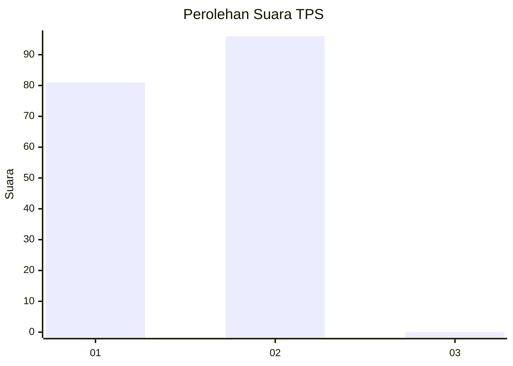
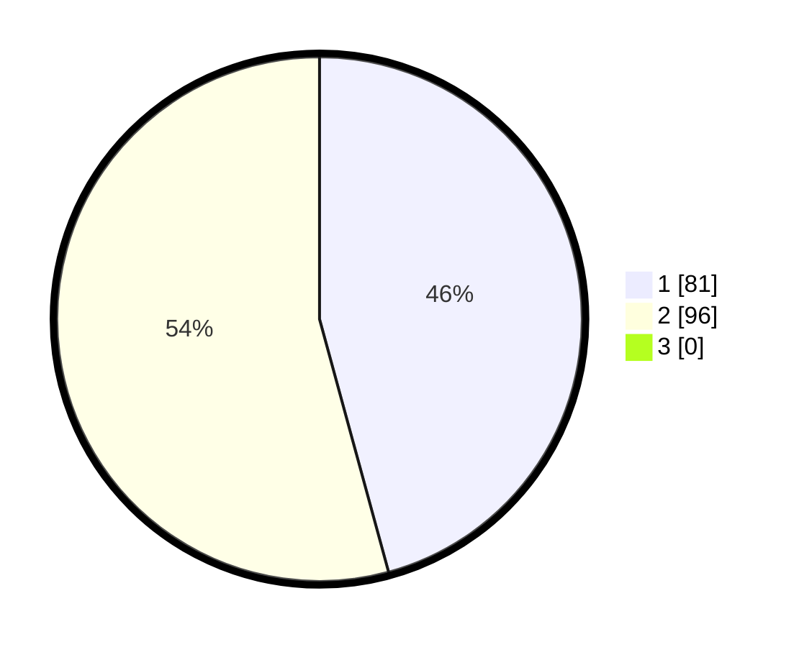

# Hasil

## Grafik

## Tabel

| No. | Nama Paslon    | Suara | Suara (raw) | Persentase |
|:--- |:-------------- | -----:| -----------:| ----------:|
| 1   | ANIES MUHAIMIN | 81    | [81][p-1]   | 45,76      |
| 2   | PRABOWO GIBRAN | 96    | [96][p-2]   | 54,24      |
| 3   | GANJAR MAHFUD  | 0     | [0][p-3]    | 0,00       |

[p-1]: https://github.com/gigit-pemilu/pemilu-2024-72-sulawesi-tengah/blob/main/pilpres/hitung-suara/sub/72-sulawesi-tengah/sub/71-kota-palu/sub/02-palu-barat/sub/1002-ujuna/sub/005-tps/sub/paslon-1.txt
[p-2]: https://github.com/gigit-pemilu/pemilu-2024-72-sulawesi-tengah/blob/main/pilpres/hitung-suara/sub/72-sulawesi-tengah/sub/71-kota-palu/sub/02-palu-barat/sub/1002-ujuna/sub/005-tps/sub/paslon-2.txt
[p-3]: https://github.com/gigit-pemilu/pemilu-2024-72-sulawesi-tengah/blob/main/pilpres/hitung-suara/sub/72-sulawesi-tengah/sub/71-kota-palu/sub/02-palu-barat/sub/1002-ujuna/sub/005-tps/sub/paslon-3.txt

## Foto C Plano

https://sirekap-obj-formc.kpu.go.id/a5eb/pemilu/ppwp/72/71/02/10/02/7271021002005-20240214-141422--62e752dd-4577-4317-9a38-28d21b3920ac.jpg

https://sirekap-obj-formc.kpu.go.id/a5eb/pemilu/ppwp/72/71/02/10/02/7271021002005-20240214-141622--fe277556-7cb2-4830-b4d6-44574caee374.jpg

https://sirekap-obj-formc.kpu.go.id/a5eb/pemilu/ppwp/72/71/02/10/02/7271021002005-20240214-141757--bcee7e25-4002-4e00-936a-7760e09f911c.jpg

## Metadata

| Key        | Value               |
| ---------- | ------------------- |
| Time Stamp | 2024-03-06 20:00:00 |

