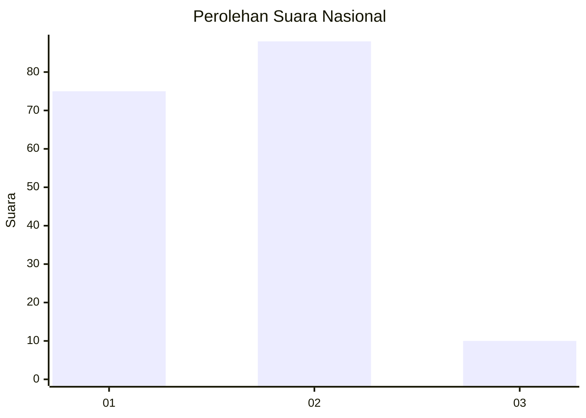
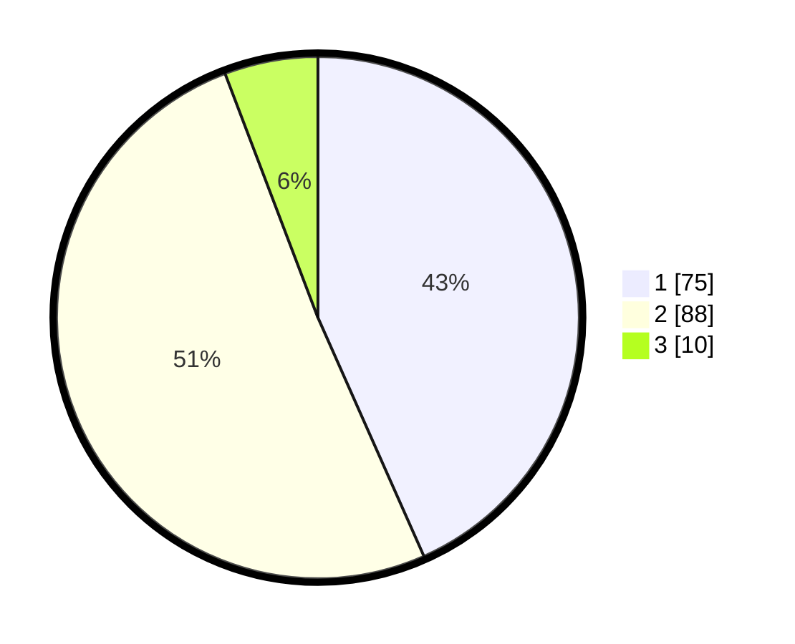

# Hasil

## Grafik

## Tabel

| No. | Nama Paslon    | Suara | Suara (raw) | Persentase |
|:--- |:-------------- | -----:| -----------:| ----------:|
| 1   | ANIES MUHAIMIN | 75    | [75][p-1]   | 43,35      |
| 2   | PRABOWO GIBRAN | 88    | [88][p-2]   | 50,87      |
| 3   | GANJAR MAHFUD  | 10    | [10][p-3]   | 5,78       |

[p-1]: https://github.com/gigit-pemilu/pemilu-2024/blob/main/pilpres/hitung-suara/sub/72-sulawesi-tengah/sub/71-kota-palu/sub/03-palu-selatan/sub/1001-tatura-utara/sub/003-tps/sub/paslon-1.txt
[p-2]: https://github.com/gigit-pemilu/pemilu-2024/blob/main/pilpres/hitung-suara/sub/72-sulawesi-tengah/sub/71-kota-palu/sub/03-palu-selatan/sub/1001-tatura-utara/sub/003-tps/sub/paslon-2.txt
[p-3]: https://github.com/gigit-pemilu/pemilu-2024/blob/main/pilpres/hitung-suara/sub/72-sulawesi-tengah/sub/71-kota-palu/sub/03-palu-selatan/sub/1001-tatura-utara/sub/003-tps/sub/paslon-3.txt

## Foto C Plano

https://sirekap-obj-formc.kpu.go.id/0d59/pemilu/ppwp/72/71/03/10/01/7271031001003-20240215-022528--5fd0a504-bfed-4241-9de5-e23624bc94ac.jpg

https://sirekap-obj-formc.kpu.go.id/0d59/pemilu/ppwp/72/71/03/10/01/7271031001003-20240215-002954--bf15766b-76bb-43a7-8f18-256801c59ad1.jpg

https://sirekap-obj-formc.kpu.go.id/0d59/pemilu/ppwp/72/71/03/10/01/7271031001003-20240215-004647--b4db64d0-ef97-4e24-86c7-3499744b1fa1.jpg

## Metadata

| Key        | Value               |
| ---------- | ------------------- |
| Time Stamp | 2024-03-06 20:00:00 |

