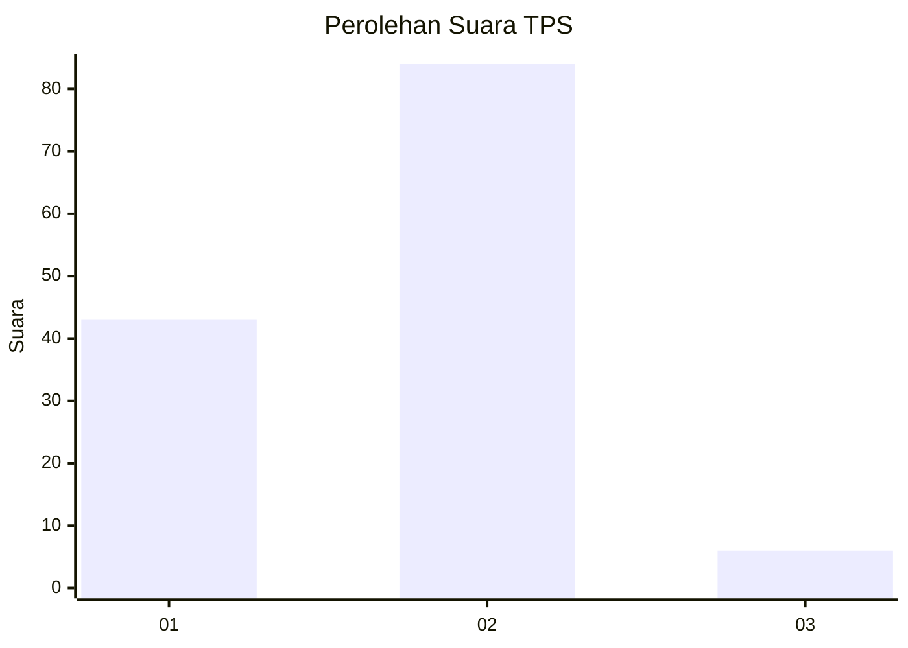
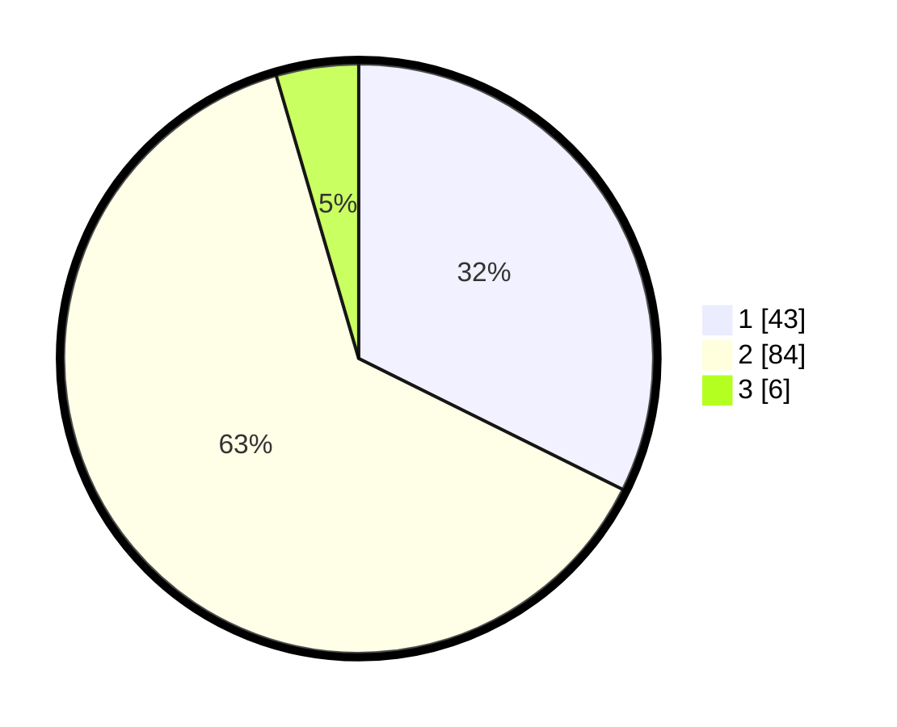

# Hasil

## Grafik

## Tabel

| No. | Nama Paslon    | Suara | Suara (raw) | Persentase |
|:--- |:-------------- | -----:| -----------:| ----------:|
| 1   | ANIES MUHAIMIN | 43    | [43][p-1]   | 32,33      |
| 2   | PRABOWO GIBRAN | 84    | [84][p-2]   | 63,16      |
| 3   | GANJAR MAHFUD  | 6     | [6][p-3]    | 4,51       |

[p-1]: https://github.com/gigit-pemilu/pemilu-2024-72-sulawesi-tengah/blob/main/pilpres/hitung-suara/sub/72-sulawesi-tengah/sub/71-kota-palu/sub/03-palu-selatan/sub/1001-tatura-utara/sub/004-tps/sub/paslon-1.txt
[p-2]: https://github.com/gigit-pemilu/pemilu-2024-72-sulawesi-tengah/blob/main/pilpres/hitung-suara/sub/72-sulawesi-tengah/sub/71-kota-palu/sub/03-palu-selatan/sub/1001-tatura-utara/sub/004-tps/sub/paslon-2.txt
[p-3]: https://github.com/gigit-pemilu/pemilu-2024-72-sulawesi-tengah/blob/main/pilpres/hitung-suara/sub/72-sulawesi-tengah/sub/71-kota-palu/sub/03-palu-selatan/sub/1001-tatura-utara/sub/004-tps/sub/paslon-3.txt

## Foto C Plano

https://sirekap-obj-formc.kpu.go.id/60d3/pemilu/ppwp/72/71/03/10/01/7271031001004-20240214-224129--613f4432-ccc2-42c7-b72b-2133ba65906c.jpg

https://sirekap-obj-formc.kpu.go.id/60d3/pemilu/ppwp/72/71/03/10/01/7271031001004-20240214-224406--3a4e81c7-304e-4d64-9357-9c1fa08669da.jpg

https://sirekap-obj-formc.kpu.go.id/60d3/pemilu/ppwp/72/71/03/10/01/7271031001004-20240215-061808--65129182-9479-4b0e-89c4-144f52f19e6e.jpg

## Metadata

| Key        | Value               |
| ---------- | ------------------- |
| Time Stamp | 2024-03-06 20:00:00 |

