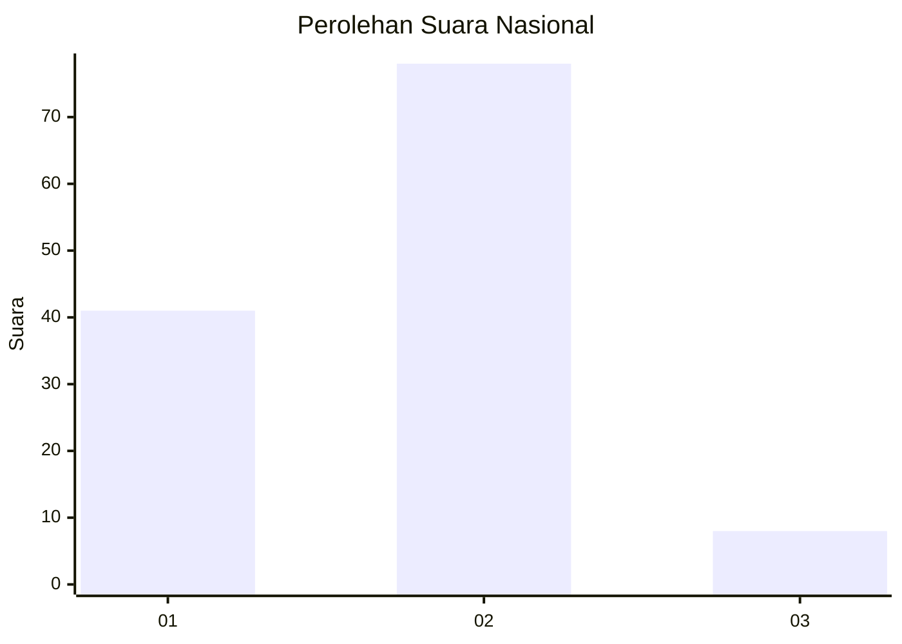
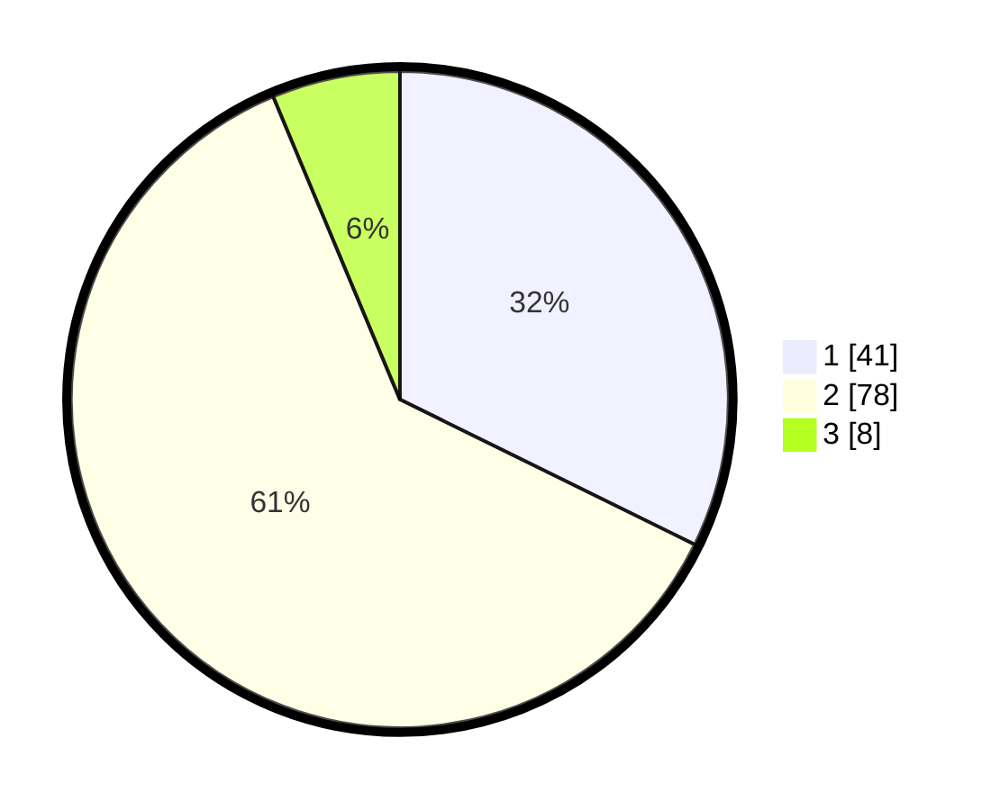

# Hasil

## Grafik

## Tabel

| No. | Nama Paslon    | Suara | Suara (raw) | Persentase |
|:--- |:-------------- | -----:| -----------:| ----------:|
| 1   | ANIES MUHAIMIN | 41    | [41][p-1]   | 32,28      |
| 2   | PRABOWO GIBRAN | 78    | [78][p-2]   | 61,42      |
| 3   | GANJAR MAHFUD  | 8     | [8][p-3]    | 6,30       |

[p-1]: https://github.com/gigit-pemilu/pemilu-2024/blob/main/pilpres/hitung-suara/sub/72-sulawesi-tengah/sub/71-kota-palu/sub/04-palu-utara/sub/1001-mamboro/sub/001-tps/sub/paslon-1.txt
[p-2]: https://github.com/gigit-pemilu/pemilu-2024/blob/main/pilpres/hitung-suara/sub/72-sulawesi-tengah/sub/71-kota-palu/sub/04-palu-utara/sub/1001-mamboro/sub/001-tps/sub/paslon-2.txt
[p-3]: https://github.com/gigit-pemilu/pemilu-2024/blob/main/pilpres/hitung-suara/sub/72-sulawesi-tengah/sub/71-kota-palu/sub/04-palu-utara/sub/1001-mamboro/sub/001-tps/sub/paslon-3.txt

## Foto C Plano

https://sirekap-obj-formc.kpu.go.id/0da0/pemilu/ppwp/72/71/04/10/01/7271041001001-20240214-230057--dd868f61-6839-4578-9cbb-4c453e9b2ee5.jpg

https://sirekap-obj-formc.kpu.go.id/0da0/pemilu/ppwp/72/71/04/10/01/7271041001001-20240214-230118--a8a014f2-0cd2-4437-8fc9-b5a78ff4a06f.jpg

https://sirekap-obj-formc.kpu.go.id/0da0/pemilu/ppwp/72/71/04/10/01/7271041001001-20240214-230134--307dbda5-103c-4f82-a0de-02fc4ca6327b.jpg

## Metadata

| Key        | Value               |
| ---------- | ------------------- |
| Time Stamp | 2024-03-06 20:00:00 |

