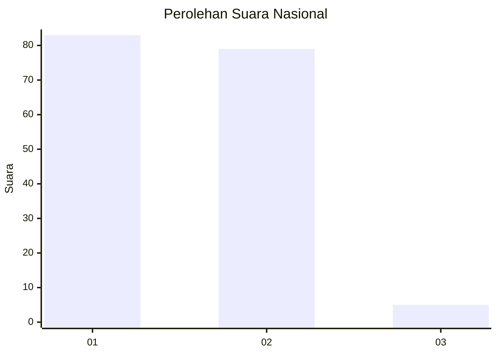
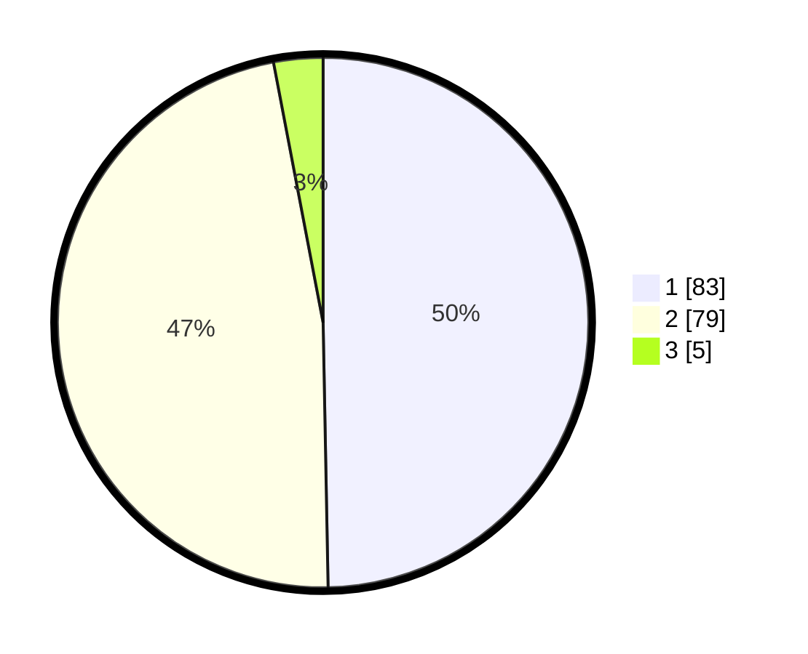

# Hasil

## Grafik

## Tabel

| No. | Nama Paslon    | Suara | Suara (raw) | Persentase |
|:--- |:-------------- | -----:| -----------:| ----------:|
| 1   | ANIES MUHAIMIN | 83    | [83][p-1]   | 49,70      |
| 2   | PRABOWO GIBRAN | 79    | [79][p-2]   | 47,31      |
| 3   | GANJAR MAHFUD  | 5     | [5][p-3]    | 2,99       |

[p-1]: https://github.com/gigit-pemilu/pemilu-2024/blob/main/pilpres/hitung-suara/sub/72-sulawesi-tengah/sub/71-kota-palu/sub/04-palu-utara/sub/1001-mamboro/sub/005-tps/sub/paslon-1.txt
[p-2]: https://github.com/gigit-pemilu/pemilu-2024/blob/main/pilpres/hitung-suara/sub/72-sulawesi-tengah/sub/71-kota-palu/sub/04-palu-utara/sub/1001-mamboro/sub/005-tps/sub/paslon-2.txt
[p-3]: https://github.com/gigit-pemilu/pemilu-2024/blob/main/pilpres/hitung-suara/sub/72-sulawesi-tengah/sub/71-kota-palu/sub/04-palu-utara/sub/1001-mamboro/sub/005-tps/sub/paslon-3.txt

## Foto C Plano

https://sirekap-obj-formc.kpu.go.id/5c30/pemilu/ppwp/72/71/04/10/01/7271041001005-20240214-191100--5945a413-109c-4012-8465-b205096af4d1.jpg

https://sirekap-obj-formc.kpu.go.id/5c30/pemilu/ppwp/72/71/04/10/01/7271041001005-20240214-191200--365ab302-4dd5-414e-af95-aecf3e568a3a.jpg

https://sirekap-obj-formc.kpu.go.id/5c30/pemilu/ppwp/72/71/04/10/01/7271041001005-20240215-203954--af52f203-889e-4112-80aa-926c58b51f9d.jpg

## Metadata

| Key        | Value               |
| ---------- | ------------------- |
| Time Stamp | 2024-03-06 20:00:00 |

