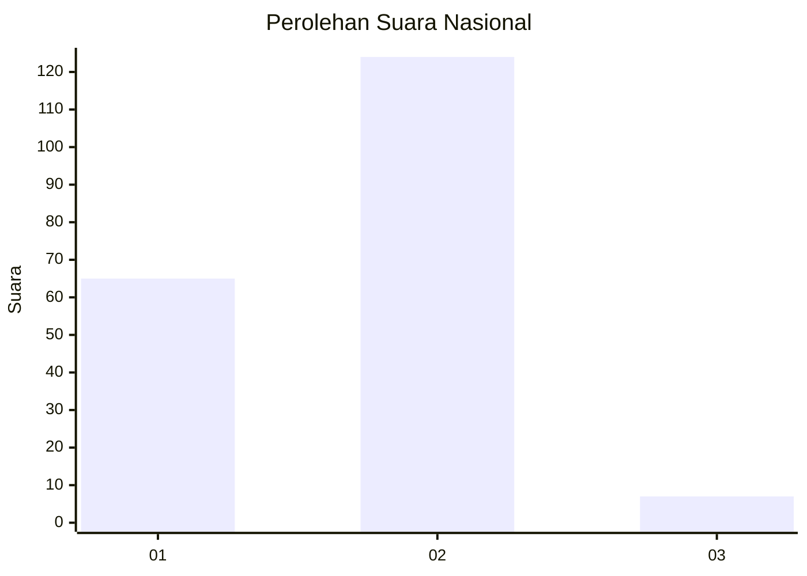
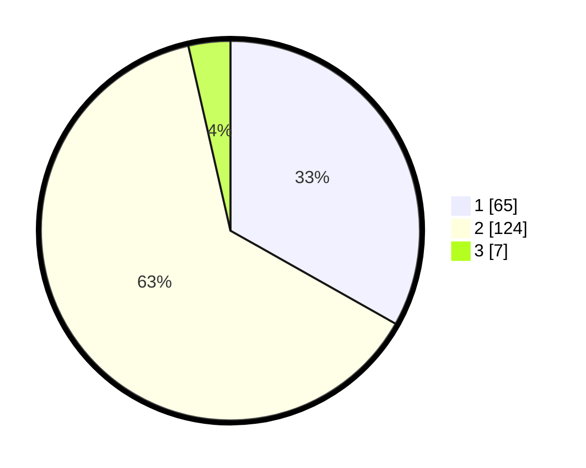

# Hasil

## Grafik

## Tabel

| No. | Nama Paslon    | Suara | Suara (raw) | Persentase |
|:--- |:-------------- | -----:| -----------:| ----------:|
| 1   | ANIES MUHAIMIN | 65    | [65][p-1]   | 33,16      |
| 2   | PRABOWO GIBRAN | 124   | [124][p-2]  | 63,27      |
| 3   | GANJAR MAHFUD  | 7     | [7][p-3]    | 3,57       |

[p-1]: https://github.com/gigit-pemilu/pemilu-2024/blob/main/pilpres/hitung-suara/sub/72-sulawesi-tengah/sub/71-kota-palu/sub/06-tatanga/sub/1001-nunu/sub/001-tps/sub/paslon-1.txt
[p-2]: https://github.com/gigit-pemilu/pemilu-2024/blob/main/pilpres/hitung-suara/sub/72-sulawesi-tengah/sub/71-kota-palu/sub/06-tatanga/sub/1001-nunu/sub/001-tps/sub/paslon-2.txt
[p-3]: https://github.com/gigit-pemilu/pemilu-2024/blob/main/pilpres/hitung-suara/sub/72-sulawesi-tengah/sub/71-kota-palu/sub/06-tatanga/sub/1001-nunu/sub/001-tps/sub/paslon-3.txt

## Foto C Plano

https://sirekap-obj-formc.kpu.go.id/b10e/pemilu/ppwp/72/71/06/10/01/7271061001001-20240215-061150--a699fd60-e291-48b7-be31-17bfc0719174.jpg

https://sirekap-obj-formc.kpu.go.id/b10e/pemilu/ppwp/72/71/06/10/01/7271061001001-20240215-061347--201510fa-5bba-4283-aa6c-7c4d6ea5ee41.jpg

https://sirekap-obj-formc.kpu.go.id/b10e/pemilu/ppwp/72/71/06/10/01/7271061001001-20240215-061602--b9259a2c-a9d0-47b9-89ae-82c6b8e66fa4.jpg

## Metadata

| Key        | Value               |
| ---------- | ------------------- |
| Time Stamp | 2024-03-06 20:00:00 |

