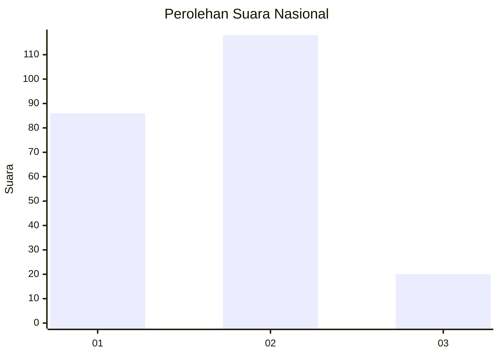
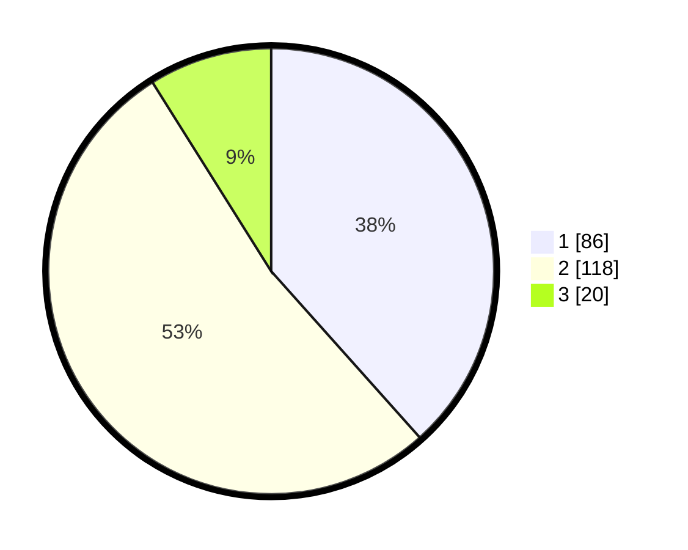

# Hasil

## Grafik

## Tabel

| No. | Nama Paslon    | Suara | Suara (raw) | Persentase |
|:--- |:-------------- | -----:| -----------:| ----------:|
| 1   | ANIES MUHAIMIN | 86    | [86][p-1]   | 38,39      |
| 2   | PRABOWO GIBRAN | 118   | [118][p-2]  | 52,68      |
| 3   | GANJAR MAHFUD  | 20    | [20][p-3]   | 8,93       |

[p-1]: https://github.com/gigit-pemilu/pemilu-2024/blob/main/pilpres/hitung-suara/sub/72-sulawesi-tengah/sub/71-kota-palu/sub/06-tatanga/sub/1001-nunu/sub/003-tps/sub/paslon-1.txt
[p-2]: https://github.com/gigit-pemilu/pemilu-2024/blob/main/pilpres/hitung-suara/sub/72-sulawesi-tengah/sub/71-kota-palu/sub/06-tatanga/sub/1001-nunu/sub/003-tps/sub/paslon-2.txt
[p-3]: https://github.com/gigit-pemilu/pemilu-2024/blob/main/pilpres/hitung-suara/sub/72-sulawesi-tengah/sub/71-kota-palu/sub/06-tatanga/sub/1001-nunu/sub/003-tps/sub/paslon-3.txt

## Foto C Plano

https://sirekap-obj-formc.kpu.go.id/c79d/pemilu/ppwp/72/71/06/10/01/7271061001003-20240215-063701--244fe655-7e94-4a5c-81b9-8d13f6f80899.jpg

https://sirekap-obj-formc.kpu.go.id/c79d/pemilu/ppwp/72/71/06/10/01/7271061001003-20240215-062445--99e23685-054f-46ad-8975-77e7fed57c82.jpg

https://sirekap-obj-formc.kpu.go.id/c79d/pemilu/ppwp/72/71/06/10/01/7271061001003-20240215-062657--35546454-c369-40a8-bfbd-9cb06307fdf5.jpg

## Metadata

| Key        | Value               |
| ---------- | ------------------- |
| Time Stamp | 2024-03-06 20:00:00 |

