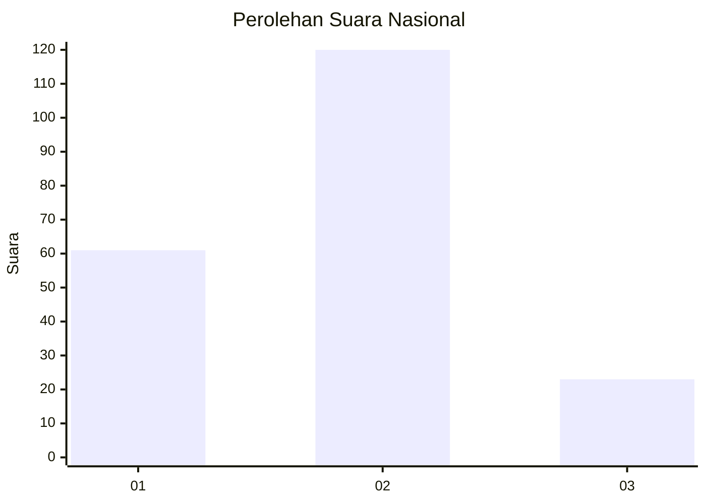
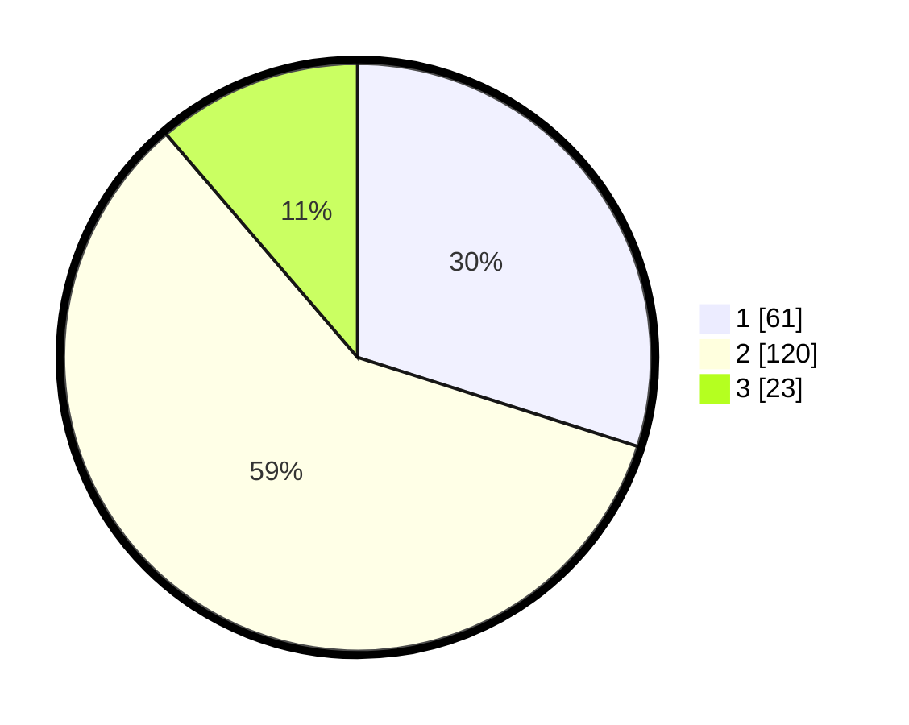

# Hasil

## Grafik

## Tabel

| No. | Nama Paslon    | Suara | Suara (raw) | Persentase |
|:--- |:-------------- | -----:| -----------:| ----------:|
| 1   | ANIES MUHAIMIN | 61    | [61][p-1]   | 29,90      |
| 2   | PRABOWO GIBRAN | 120   | [120][p-2]  | 58,82      |
| 3   | GANJAR MAHFUD  | 23    | [23][p-3]   | 11,27      |

[p-1]: https://github.com/gigit-pemilu/pemilu-2024/blob/main/pilpres/hitung-suara/sub/72-sulawesi-tengah/sub/71-kota-palu/sub/06-tatanga/sub/1001-nunu/sub/004-tps/sub/paslon-1.txt
[p-2]: https://github.com/gigit-pemilu/pemilu-2024/blob/main/pilpres/hitung-suara/sub/72-sulawesi-tengah/sub/71-kota-palu/sub/06-tatanga/sub/1001-nunu/sub/004-tps/sub/paslon-2.txt
[p-3]: https://github.com/gigit-pemilu/pemilu-2024/blob/main/pilpres/hitung-suara/sub/72-sulawesi-tengah/sub/71-kota-palu/sub/06-tatanga/sub/1001-nunu/sub/004-tps/sub/paslon-3.txt

## Foto C Plano

https://sirekap-obj-formc.kpu.go.id/3834/pemilu/ppwp/72/71/06/10/01/7271061001004-20240214-211613--24015039-6fbf-4e59-b791-ab237b5ba420.jpg

https://sirekap-obj-formc.kpu.go.id/3834/pemilu/ppwp/72/71/06/10/01/7271061001004-20240215-075333--111f9ef0-518d-40d5-a63e-2d720eaade36.jpg

https://sirekap-obj-formc.kpu.go.id/3834/pemilu/ppwp/72/71/06/10/01/7271061001004-20240214-212054--bee53930-9d4d-441a-a3b8-4c0d33f6f52c.jpg

## Metadata

| Key        | Value               |
| ---------- | ------------------- |
| Time Stamp | 2024-03-06 20:00:00 |

