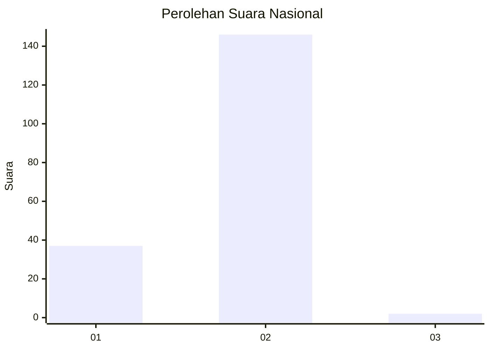
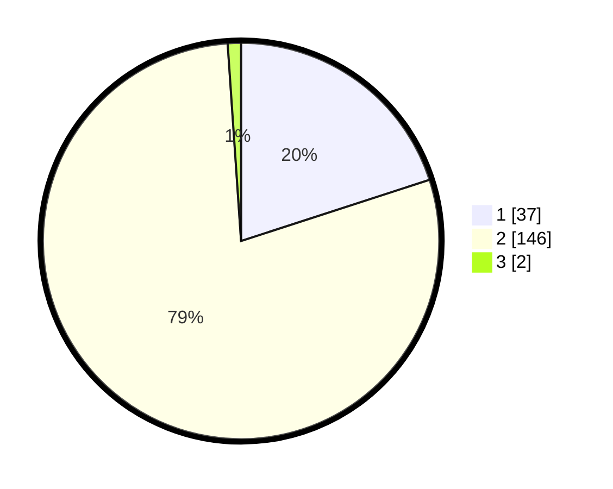

# Hasil

## Grafik

## Tabel

| No. | Nama Paslon    | Suara | Suara (raw) | Persentase |
|:--- |:-------------- | -----:| -----------:| ----------:|
| 1   | ANIES MUHAIMIN | 37    | [37][p-1]   | 20,00      |
| 2   | PRABOWO GIBRAN | 146   | [146][p-2]  | 78,92      |
| 3   | GANJAR MAHFUD  | 2     | [2][p-3]    | 1,08       |

[p-1]: https://github.com/gigit-pemilu/pemilu-2024/blob/main/pilpres/hitung-suara/sub/72-sulawesi-tengah/sub/71-kota-palu/sub/07-tawaeli/sub/1001-pantoloan/sub/002-tps/sub/paslon-1.txt
[p-2]: https://github.com/gigit-pemilu/pemilu-2024/blob/main/pilpres/hitung-suara/sub/72-sulawesi-tengah/sub/71-kota-palu/sub/07-tawaeli/sub/1001-pantoloan/sub/002-tps/sub/paslon-2.txt
[p-3]: https://github.com/gigit-pemilu/pemilu-2024/blob/main/pilpres/hitung-suara/sub/72-sulawesi-tengah/sub/71-kota-palu/sub/07-tawaeli/sub/1001-pantoloan/sub/002-tps/sub/paslon-3.txt

## Foto C Plano

https://sirekap-obj-formc.kpu.go.id/ac00/pemilu/ppwp/72/71/07/10/01/7271071001002-20240214-162208--49fa821b-0c63-4356-9421-ea4788f9f5e3.jpg

https://sirekap-obj-formc.kpu.go.id/ac00/pemilu/ppwp/72/71/07/10/01/7271071001002-20240217-062105--9bd4b49a-0182-4e0c-9f48-87cf182d5550.jpg

https://sirekap-obj-formc.kpu.go.id/ac00/pemilu/ppwp/72/71/07/10/01/7271071001002-20240217-062116--6911cfc0-e966-4e5c-bffd-04fada0f0bb6.jpg

## Metadata

| Key        | Value               |
| ---------- | ------------------- |
| Time Stamp | 2024-03-06 20:00:00 |

