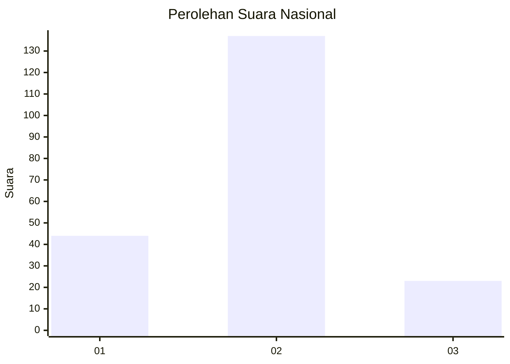
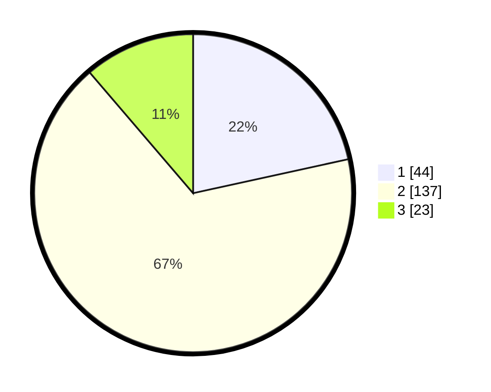

# Hasil

## Grafik

## Tabel

| No. | Nama Paslon    | Suara | Suara (raw) | Persentase |
|:--- |:-------------- | -----:| -----------:| ----------:|
| 1   | ANIES MUHAIMIN | 44    | [44][p-1]   | 21,57      |
| 2   | PRABOWO GIBRAN | 137   | [137][p-2]  | 67,16      |
| 3   | GANJAR MAHFUD  | 23    | [23][p-3]   | 11,27      |

[p-1]: https://github.com/gigit-pemilu/pemilu-2024/blob/main/pilpres/hitung-suara/sub/72-sulawesi-tengah/sub/71-kota-palu/sub/08-mantikulore/sub/1001-layana-indah/sub/001-tps/sub/paslon-1.txt
[p-2]: https://github.com/gigit-pemilu/pemilu-2024/blob/main/pilpres/hitung-suara/sub/72-sulawesi-tengah/sub/71-kota-palu/sub/08-mantikulore/sub/1001-layana-indah/sub/001-tps/sub/paslon-2.txt
[p-3]: https://github.com/gigit-pemilu/pemilu-2024/blob/main/pilpres/hitung-suara/sub/72-sulawesi-tengah/sub/71-kota-palu/sub/08-mantikulore/sub/1001-layana-indah/sub/001-tps/sub/paslon-3.txt

## Foto C Plano

https://sirekap-obj-formc.kpu.go.id/2cf7/pemilu/ppwp/72/71/08/10/01/7271081001001-20240217-224804--0f5ef8c8-a51a-48e9-9ca0-4371edd268f4.jpg

https://sirekap-obj-formc.kpu.go.id/2cf7/pemilu/ppwp/72/71/08/10/01/7271081001001-20240215-012617--325b494d-c5c0-42ea-a387-f2a0d4f6b343.jpg

https://sirekap-obj-formc.kpu.go.id/2cf7/pemilu/ppwp/72/71/08/10/01/7271081001001-20240215-012634--a46ad1b0-534a-4401-b39a-f6e3876ed0ef.jpg

## Metadata

| Key        | Value               |
| ---------- | ------------------- |
| Time Stamp | 2024-03-06 20:00:00 |

