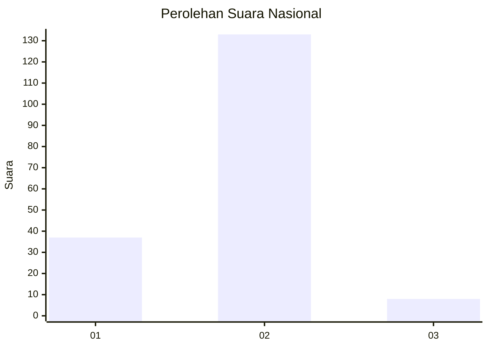
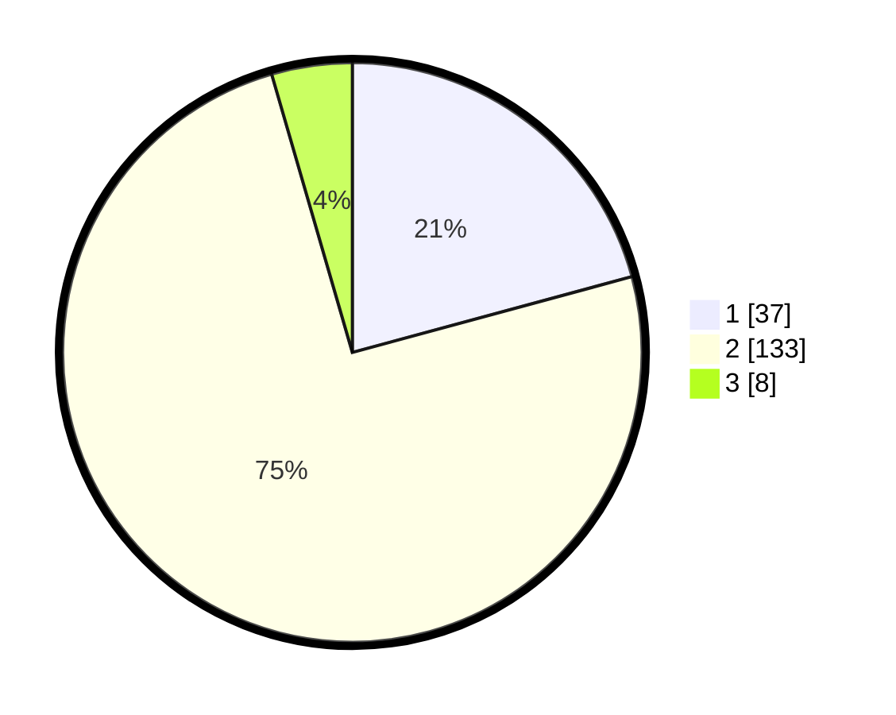

# Hasil

## Grafik

## Tabel

| No. | Nama Paslon    | Suara | Suara (raw) | Persentase |
|:--- |:-------------- | -----:| -----------:| ----------:|
| 1   | ANIES MUHAIMIN | 37    | [37][p-1]   | 20,79      |
| 2   | PRABOWO GIBRAN | 133   | [133][p-2]  | 74,72      |
| 3   | GANJAR MAHFUD  | 8     | [8][p-3]    | 4,49       |

[p-1]: https://github.com/gigit-pemilu/pemilu-2024/blob/main/pilpres/hitung-suara/sub/72-sulawesi-tengah/sub/71-kota-palu/sub/08-mantikulore/sub/1001-layana-indah/sub/005-tps/sub/paslon-1.txt
[p-2]: https://github.com/gigit-pemilu/pemilu-2024/blob/main/pilpres/hitung-suara/sub/72-sulawesi-tengah/sub/71-kota-palu/sub/08-mantikulore/sub/1001-layana-indah/sub/005-tps/sub/paslon-2.txt
[p-3]: https://github.com/gigit-pemilu/pemilu-2024/blob/main/pilpres/hitung-suara/sub/72-sulawesi-tengah/sub/71-kota-palu/sub/08-mantikulore/sub/1001-layana-indah/sub/005-tps/sub/paslon-3.txt

## Foto C Plano

https://sirekap-obj-formc.kpu.go.id/1c78/pemilu/ppwp/72/71/08/10/01/7271081001005-20240314-232335--8ff82b74-ba24-44b8-b8eb-7524a358ac3b.jpg

https://sirekap-obj-formc.kpu.go.id/1c78/pemilu/ppwp/72/71/08/10/01/7271081001005-20240214-194030--64a079ce-5d79-4636-ac5c-852d4823f610.jpg

https://sirekap-obj-formc.kpu.go.id/1c78/pemilu/ppwp/72/71/08/10/01/7271081001005-20240214-194238--807bfc4d-93a6-4d09-b5a1-3efcf80eb01f.jpg

## Metadata

| Key        | Value               |
| ---------- | ------------------- |
| Time Stamp | 2024-03-14 23:30:00 |

